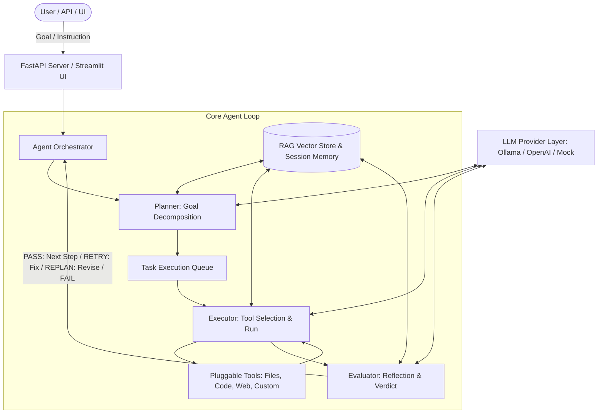

# AI Agent Builder ⚡

AI Agent Builder is a lightweight, autonomous AI agent framework that converts a natural-language user goal into a structured, autonomously executed plan.

Rather than returning a single LLM response, the system decomposes the goal into discrete tasks, selects and invokes tools, evaluates intermediate step outcomes, and iterates using a persistent RAG memory layer.

---

## 🌟 Key Architecture & Capabilities



- **Goal → Task Planning**: Decomposes free-text goals into ordered, actionable task steps with clear expected outcomes and replanning triggers.
- **Autonomous Execution Engine**: Sequentially executes plan steps, synthesizing tool parameters and invoking tools without requiring human intervention between steps.
- **Iterative Reflection Loop**: Evaluates each step's output against expected criteria and decides whether to `PASS`, `RETRY`, `REPLAN`, or `FAIL`.
- **Pluggable Tool Registry**: Common adapter interface supporting File Manager, Code Execution, Web Search, and drop-in custom Python tools in `app/tools/custom/`.
- **RAG Memory Layer**: Semantic search over past step outputs for short-term continuity across multi-step runs.
- **Flexible LLM Provider Layer**: Switch between local models via **Ollama**, cloud APIs (**OpenAI**), or deterministic **Mock** mode without code changes.
- **FastAPI Backend & Interactive Dashboard**: Complete REST API, Server-Sent Events (SSE), and a modern Streamlit UI.

---

## 🚀 Quick Start

### 1. Installation
Create and activate a virtual environment:
```bash
python -m venv .venv
# On Windows:
.venv\Scripts\activate
# On Linux/macOS:
source .venv/bin/activate

pip install -r requirements.txt
```

### 2. Configuration
Copy `.env.example` to `.env` and set your preferred provider:
```bash
cp .env.example .env
```

To run with **Local Ollama**:
```env
LLM_PROVIDER=ollama
LLM_MODEL=llama3:latest
OLLAMA_BASE_URL=http://localhost:11434
```

To run with **OpenAI**:
```env
LLM_PROVIDER=openai
LLM_MODEL=gpt-4o-mini
OPENAI_API_KEY=your_key_here
```

To run in **Offline Mock Mode** (instant testing):
```env
LLM_PROVIDER=mock
```

---

## 🖥️ Running the Application

### Option A: Interactive Web UI (Streamlit)
```bash
streamlit run ui/dashboard.py
```
Open [http://localhost:8501](http://localhost:8501) in your browser.

### Option B: FastAPI Backend API Server
```bash
uvicorn app.main:app --port 8000 --reload
```
- Interactive API Docs: [http://localhost:8000/docs](http://localhost:8000/docs)
- Health Check: [http://localhost:8000/health](http://localhost:8000/health)

---

## 🛠️ Adding Custom Tools

To add a new tool, create a new Python file in `app/tools/custom/` inheriting from `BaseTool`:

```python
# app/tools/custom/my_tool.py
from app.tools.base import BaseTool, ToolResult

class MyTool(BaseTool):
    name: str = "my_tool"
    description: str = "Describe what this tool does and its parameters."

    def execute(self, text: str, **kwargs) -> ToolResult:
        # Custom logic here
        return ToolResult(success=True, output=f"Processed: {text}")
```
The system will automatically discover and register your tool upon startup!

---

## 🧪 Running Tests

```bash
pytest tests/ -v
```
